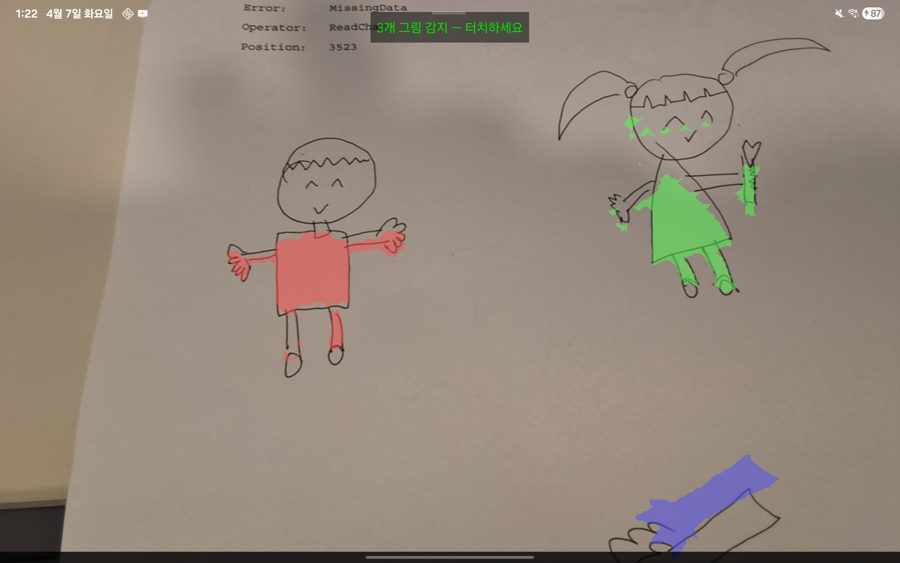
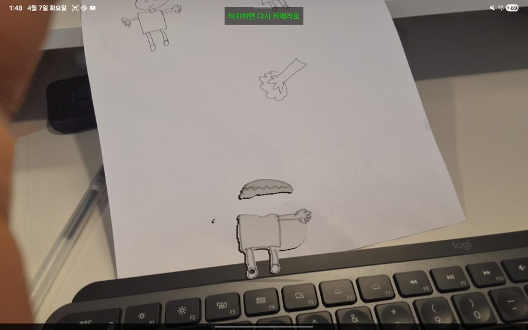
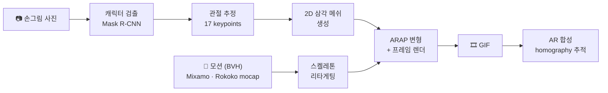

<div align="center">

# StickerBook

**아이의 손그림 한 장이, 종이 위에서 춤추는 AR 캐릭터가 된다**

*Draw it. Snap it. Watch it dance.*

[](https://www.python.org/)
[](https://kotlinlang.org/)
[](https://fastapi.tiangolo.com/)
[](https://pytorch.org/)
[](#repository-tour)

<br>


*손그림 사진 **한 장**에서 자동 생성된 캐릭터가 Mixamo 모션 14종으로 동시에 춤추는 모습.*

</div>

---

## What is this?

**종이에 그린 그림을 카메라로 찍으면 → 캐릭터를 자동으로 오려내고 관절을 찾아 → 선택한 춤을 입힌 GIF / AR 스티커가 된다.**

Meta의 [AnimatedDrawings](https://github.com/facebookresearch/AnimatedDrawings) 엔진을 중심으로, 손그림 분류 → 2.5D asset 파이프라인 → PC AR 데모 → Android on-device 포팅 → 클라이언트-서버 배포까지의 **전체 개발 여정을 담은 mono-repo**.

| You provide | You get |
|---|---|
| 손그림 사진 1장 + 모션 선택 | 춤추는 캐릭터 GIF (모션 22종 · 512px · GPU 약 13초) · 종이 위 AR 합성 (homography 추적) · 갤럭시탭 데모 앱 |

## See it

<div align="center">
<table>
<tr>
<td align="center" width="34%">
<br>
<em>① 입력 — 종이 위 손그림</em>
</td>
<td align="center" width="33%">
<br>
<em>② 출력 — 모션 적용 GIF</em>
</td>
<td align="center" width="33%">
<br>
<em>③ 직접 녹화한 mocap 모션도 적용</em>
</td>
</tr>
</table>




*2.5D asset 트랙 — 평면 그림이 빛과 그림자에 반응하는 Android 뷰어.*
</div>

## How it works

그림 한 장이 춤추는 캐릭터가 되기까지:



- **검출·포즈**: torchserve가 서빙하는 AnimatedDrawings의 humanoid detector + pose estimator
- **ARAP** (As-Rigid-As-Possible): 관절이 움직일 때 메쉬가 찢어지지 않고 자연스럽게 따라 변형되는 최적화
- **AR 추적**: ORB + RANSAC homography로 종이 위치를 매 프레임 추적 — 종이가 움직여도 스티커가 따라감

## Three tracks

같은 목표("그림 → 춤추는 스티커")를 세 가지 런타임으로 구현했다:

| 트랙 | 위치 | 처리 위치 | 상태 |
|---|---|---|---|
| **V1 — PC PoC** | [`stickerbook-pc/`](stickerbook-pc/) | PC (웹캠 + AD subprocess + AR 합성) | ✅ 완료 |
| **V2 — Android on-device** | [`app/`](app/) | 갤탭 단독 (ONNX + Kotlin ARAP, 인터넷 불필요) | ✅ 완료 |
| **V2-test — Client-Server** | [`ad-client/`](ad-client/) + [ad-server](https://github.com/ingon1026/ad-server) | 갤탭(thin client) ↔ GPU 서버 (FastAPI + Docker) | ✅ 운영 중 |

```text
V1  PC:              웹캠 → AD subprocess → GIF → homography AR 합성 (전부 로컬)
V2  on-device:       그림 사진 → 갤탭 내부 ONNX (detection·pose·ARAP) → AR overlay
V2t client-server:   그림 사진 → 갤탭 HTTP POST → GPU 서버 (torchserve+Mesa) → GIF → 갤탭
```

## Repository tour

개발 여정 순서 그대로:

| # | 폴더 | 무엇 | 결과 |
|---|---|---|---|
| 1 | [`classifier/`](classifier/) | 손그림 분류 — **YOLO26n-cls** | top-1 **97.3%** (3-class) |
| 2 | [`pipeline/`](pipeline/) | 2.5D asset 파이프라인 — 누끼 + depth + normal map + **auto-rig** (skeleton 분석 자동 리깅) | Android 뷰어에서 조명 반응 |
| 3 | [`sketch-guide/`](sketch-guide/) | 아이용 그리기 가이드 웹앱 (React Native) | Netlify 배포 |
| 4 | [`stickerbook-pc/`](stickerbook-pc/) | **V1** PC PoC — 웹캠 + MediaPipe mocap→BVH + AD + homography AR | 다중 스티커 · 사용자 모션 녹화 |
| 5 | [`app/`](app/) | **V2** Android on-device — ONNX (detection·pose) + Kotlin ARAP + AR 추적 | APK 520→**308MB** (INT8, IoU 0.987) |
| 6 | [`ad-client/`](ad-client/) | **V2-test** 갤탭 클라이언트 — 촬영→서버→GIF 재생·저장 | E2E 데모 · GIF 512px 약 13초 |
| — | [ad-server](https://github.com/ingon1026/ad-server) (별도 repo) | FastAPI + AnimatedDrawings + torchserve, docker-compose GPU 배포 | 모션 22종 서빙 · X-API-Key 인증 |

## Quickstart

**V2-test (client-server) 데모** — 서버가 이미 떠 있다면:

1. Android Studio로 [`ad-client/`](ad-client/) 열기
2. `local.properties`에 `AD_SERVER_API_KEY=<키>` 추가, `net/Config.kt`의 `BASE_URL`을 서버 주소로
3. 갤탭 USB 연결 후 ▶ Run → 이미지 선택 → 모션 선택 → 합치기 → GIF 재생·갤러리 저장

**V2 (on-device)** — [`app/`](app/)을 Android Studio로 열어 갤탭에 빌드. 인터넷 의존성 없음.

서버 셋업·트러블슈팅: [`ad-server/README.md`](ad-server/README.md) · API 명세: [`ad-server/shared/API.md`](ad-server/shared/API.md)

## Numbers

| 지표 | 값 |
|---|---|
| 모션 라이브러리 | **22종** — AD 기본 5 + 사용자 Rokoko mocap 3 + Mixamo 14 |
| GIF 생성 (GPU 서버) | 512×512 약 **13초** · 1024×1024 약 16초 |
| on-device APK | 520MB → **308MB** (INT8 양자화, mask IoU 0.987) |
| 분류기 | YOLO26n-cls top-1 **97.3%** |
| AR 추적 | ORB + RANSAC homography, EMA 안정화 (α=0.1) |

## Tech stack

| 영역 | 기술 |
|---|---|
| 캐릭터 검출 + 자세 추정 | AnimatedDrawings (Mask R-CNN + mmpose 기반) |
| 헤드리스 렌더링 | Mesa OffScreen (osmesa) + PyOpenGL |
| 서버 | FastAPI + uvicorn + TorchServe, docker-compose (GPU) |
| Android 클라이언트 | Kotlin + OkHttp + Glide + 코루틴 |
| Android on-device | ONNX Runtime + Canvas drawBitmapMesh (ARAP) |
| 종이 추적 | OpenCV ORB + RANSAC + homography |
| Motion 포맷 | BVH (MediaPipe 33 → 24 joint 변환 · Mixamo · Rokoko) |

## History

이 repo는 AR-Book 프로젝트의 여정을 통합한 mono-repo다. 트랙 1~4(classifier · pipeline · sketch-guide · V1 PC)의 원본 커밋 히스토리는 archived [drawing-to-2.5d](https://github.com/ingon1026/drawing-to-2.5d)에 보존되어 있다 (branches: `main` · `android-app` · `sketch-guide` · `stickerbook`).

## Credits

- [AnimatedDrawings](https://github.com/facebookresearch/AnimatedDrawings) (Meta Research, MIT) — 캐릭터 추출 + 모션 리타게팅 엔진
- [Mixamo](https://www.mixamo.com/) — 모션 데이터 · [Rokoko](https://www.rokoko.com/) — 사용자 mocap
- [MediaPipe](https://developers.google.com/mediapipe) (Apache 2.0) — V1 사용자 동작 캡처
- [RakugakiAR](https://github.com/tatsuya-ogawa/RakugakiAR) — 2.5D AR 스티커 컨셉 참고
