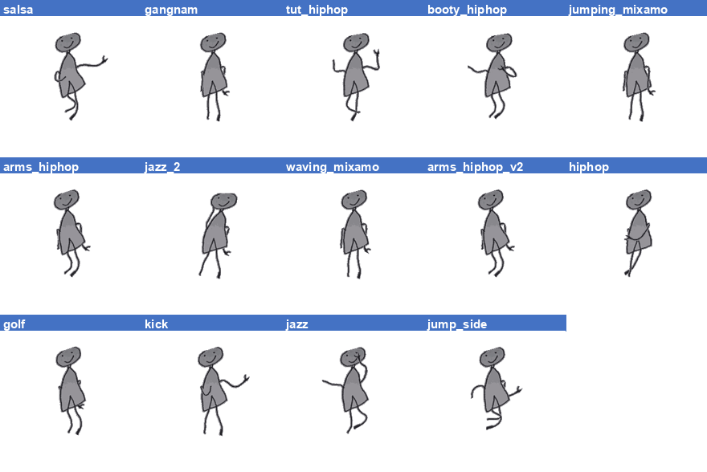
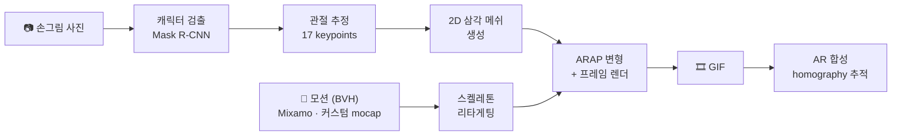
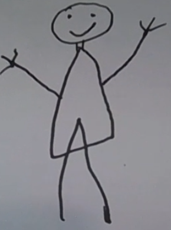
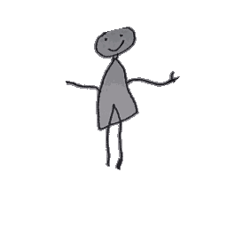
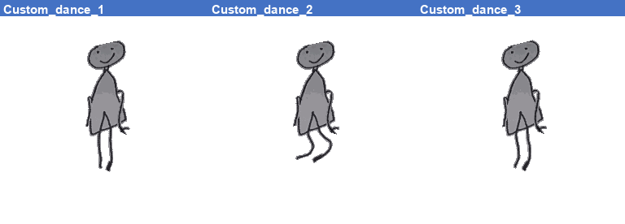

# StickerBook

종이에 그린 그림을 사진으로 찍으면, 그림 속 캐릭터를 자동으로 추출해 선택한 모션으로 움직이는 GIF를 만든다. 카메라 앞에서 직접 움직여 녹화한 동작을 커스텀 모션으로 등록해 캐릭터에 적용할 수도 있다. Meta의 [AnimatedDrawings](https://github.com/facebookresearch/AnimatedDrawings) 엔진 기반.

[](https://www.python.org/)
[](https://kotlinlang.org/)
[](https://fastapi.tiangolo.com/)
[](https://pytorch.org/)

<div align="center">


*손그림 사진 한 장에서 생성된 캐릭터에 Mixamo 모션 14종을 적용한 결과.*
</div>

## 동작 방식



- **검출·포즈**: torchserve가 서빙하는 AnimatedDrawings의 humanoid detector + pose estimator
- **ARAP** (As-Rigid-As-Possible): 관절이 움직일 때 메쉬가 찢어지지 않고 자연스럽게 따라 변형되는 최적화
- **AR 추적**: ORB + RANSAC homography로 종이 위치를 매 프레임 추적 — 종이가 움직여도 스티커가 종이 위에 붙어 있다

<div align="center">
<table>
<tr>
<td align="center" width="42%">
<br>
<em>입력 — 종이 위 손그림</em>
</td>
<td align="center" width="42%">
<br>
<em>출력 — 모션 적용 GIF</em>
</td>
</tr>
</table>
</div>

## 커스텀 모션

카메라 앞에서 동작을 녹화하면 MediaPipe Pose가 프레임마다 33개 관절을 추출하고, 이를 BVH 모션 파일로 변환해 라이브러리에 등록한다. 등록한 모션은 기본 모션과 똑같이 캐릭터에 적용된다.

```text
카메라 녹화 → MediaPipe Pose (33 landmarks/frame) → BVH 변환 (33→24 joint, m→cm) → 모션 라이브러리
```

<div align="center">


*직접 녹화한 동작 3종을 같은 캐릭터에 적용한 결과.*
</div>

모션 라이브러리는 총 22종 — AnimatedDrawings 기본 5종(dab, wave_hello, jumping, jumping_jacks, zombie) + 커스텀 mocap 3종 + Mixamo 14종(salsa, gangnam, hiphop 계열, golf, kick 등).

## 실행 구성

| 구성 | 위치 | 처리 위치 |
|---|---|---|
| PC 단독 | [`stickerbook-pc/`](stickerbook-pc/) | PC — 웹캠 입력, AD subprocess, homography AR 합성 |
| Android on-device | [`app/`](app/) | 태블릿 단독 — ONNX(detection·pose) + Kotlin ARAP, 인터넷 불필요 |
| Client-Server | [`ad-client/`](ad-client/) + [ad-server](https://github.com/ingon1026/ad-server) | 태블릿(촬영·표시) ↔ GPU 서버(FastAPI + torchserve + Docker) |

```text
PC 단독:        웹캠 → AD subprocess → GIF → homography AR 합성 (전부 로컬)
on-device:      그림 사진 → 태블릿 내부 ONNX (detection·pose·ARAP) → AR overlay
client-server:  그림 사진 → HTTP POST → GPU 서버 (torchserve+Mesa) → GIF → 태블릿
```

GIF 생성 시간은 GPU 서버 기준 512×512 약 13초, 1024×1024 약 16초.

## 폴더 구조

| 폴더 | 내용 |
|---|---|
| [`stickerbook-pc/`](stickerbook-pc/) | PC 데모 — 웹캠 캡처, MediaPipe mocap→BVH, AD 호출, 다중 스티커 AR 합성 |
| [`app/`](app/) | Android on-device 앱 — ONNX 추론, Kotlin ARAP, AR 추적, GIF 인코딩 |
| [`ad-client/`](ad-client/) | Android 클라이언트 — 촬영, 서버 요청, GIF 재생·갤러리 저장 |
| [`pipeline/`](pipeline/) | 그림 전처리 파이프라인 — 누끼, depth/normal map, skeleton 기반 auto-rig |
| [`classifier/`](classifier/) | 손그림 분류기 — YOLO26n-cls |
| [`sketch-guide/`](sketch-guide/) | 아이용 그리기 가이드 웹앱 (React Native) |
| [`docs/`](docs/) | 설계 문서, 이미지 자산 |

서버 코드는 별도 저장소 [ad-server](https://github.com/ingon1026/ad-server) — FastAPI + AnimatedDrawings + torchserve를 docker-compose로 묶어 GPU 서버에 배포하는 구성.

## Quickstart

**Client-Server 데모** (서버가 떠 있는 경우):

1. Android Studio로 [`ad-client/`](ad-client/) 열기
2. `local.properties`에 `AD_SERVER_API_KEY=<키>` 추가, `net/Config.kt`의 `BASE_URL`을 서버 주소로 설정
3. 태블릿 연결 후 ▶ Run — 이미지 선택 → 모션 선택 → 합치기 → GIF 재생·갤러리 저장

**on-device** — [`app/`](app/)을 Android Studio로 열어 태블릿에 빌드. 인터넷 의존성 없음.

서버 셋업·트러블슈팅은 [`ad-server/README.md`](ad-server/README.md), API 명세는 [`ad-server/shared/API.md`](ad-server/shared/API.md) 참조.

## 기술 스택

| 영역 | 기술 |
|---|---|
| 캐릭터 검출 + 자세 추정 | AnimatedDrawings (Mask R-CNN + mmpose 기반) |
| 헤드리스 렌더링 | Mesa OffScreen (osmesa) + PyOpenGL |
| 서버 | FastAPI + uvicorn + TorchServe, docker-compose (GPU) |
| Android 클라이언트 | Kotlin + OkHttp + Glide + 코루틴 |
| Android on-device | ONNX Runtime + Canvas drawBitmapMesh (ARAP) |
| 종이 추적 | OpenCV ORB + RANSAC + homography |
| 모션 포맷 | BVH (MediaPipe 33 → 24 joint 변환 · Mixamo · Rokoko) |

## 참고

- [AnimatedDrawings](https://github.com/facebookresearch/AnimatedDrawings) (Meta Research, MIT) — 캐릭터 추출 + 모션 리타게팅 엔진
- [MediaPipe](https://developers.google.com/mediapipe) (Apache 2.0) — 커스텀 모션 동작 캡처
- [Mixamo](https://www.mixamo.com/) — 모션 데이터
- [RakugakiAR](https://github.com/tatsuya-ogawa/RakugakiAR) — AR 스티커 컨셉 참고
